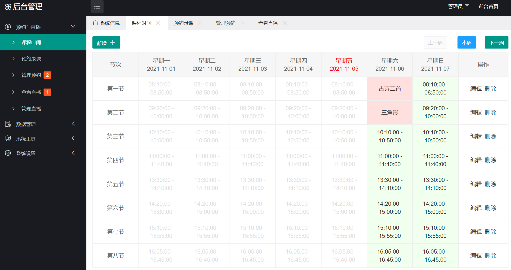
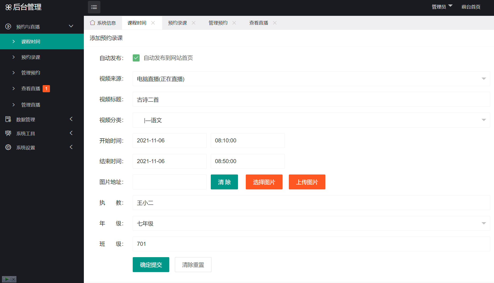
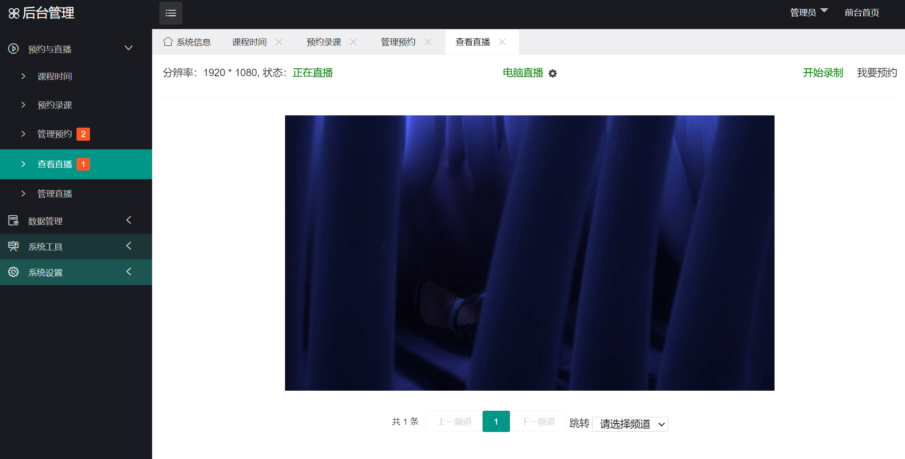

# 视频预约与录制管理系统

## 2.05版更新

增加直播源二维码预约功能。

## 2.03版更新

1.优化了后台操作界面的一些细节。

## 2.02版更新

1.加强录像稳定性，推流中断或网络不稳定等造成录像中断后会尝试继续录像。

## 2.01版更新

1.增加视频播放密码校验功能。

2.录像时显示实时录制时长。

3.修正路径名中出现一些特殊字符时可能造成的转码失败。

4.增加了转码失败后，手动转码的功能。

## 2.0版更新

1.全新后台，更加简洁与专业的界面。

2.全新增加了RTMP视频推流与直播功能，可以作为直播网站使用。

3.全新增加了RTMP视频推流的预约与录制功能，可以预约录制推流的视频。

4.全新增加了录制视频的在线剪切与自动封面截图功能（需要安装ffmpeg库）。

5.完整的课程时间表预约录课功能，还可以按课程分类自动存放录制的视频文件。

6.平台的搭建教程请查看doc文件夹中的readme.docx文档。

## 1.0版更新

海洋CMS修改版，适用于学校视频网站，主要进行了以下修改与增强。

1.更换默认主题，使用适合学校视频网站的主题风格。

2.默认栏目等都更新为合适学校的学科类栏目。

3.默认播放器更新为新增的XgPlayer播放器，功能更强大。

4.更换后台上传图片的功能。

5.新增后台上传视频的功能。

6.修复影片管理中列表可能不显示的BUG。
